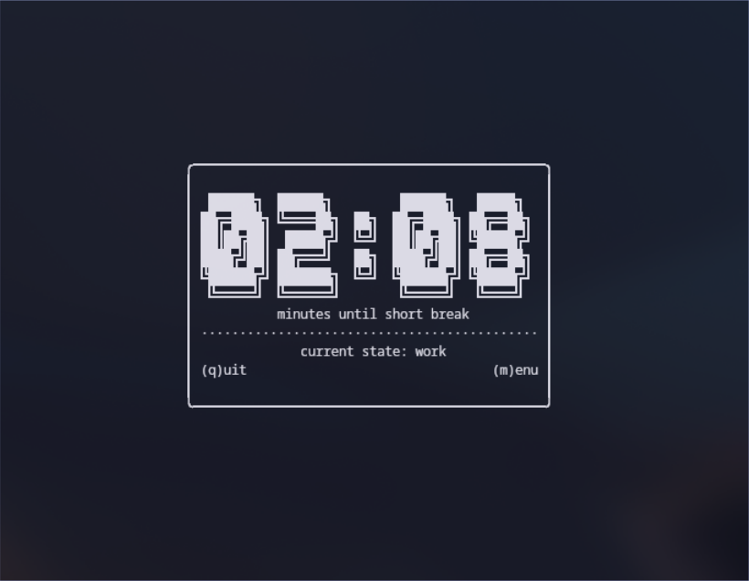

# pomosync

a terminal based universal pomodoro timer, written in rust.

## the cycle

2-hour cycle that starts every even hour (12:00, 2:00, 4:00, etc.).

## demo




## installation

built with rust.

### prerequisites

you need the rust toolchain (`rustc` and `cargo`).

### install steps

1.  clone the repo:
    ```bash
    git clone https://github.com/qtzx06/pomosync.git
    cd pomosync/tui
    ```

2.  run the script:
    ```bash
    ./install.sh
    ```

it builds the app and sticks the binary in `~/.local/bin/pomosync`. make sure that directory is in your `path`.

## usage

type `pomosync` in your terminal.

### controls

-   `(q)`: quit
-   `(p)`: pause
-   `(m)`: menu

## web version (coming soon)

i was experimenting with a three.js version of the pomodoro timer. here are some screenshots:


a full web version is coming soon.

## releases

tui
